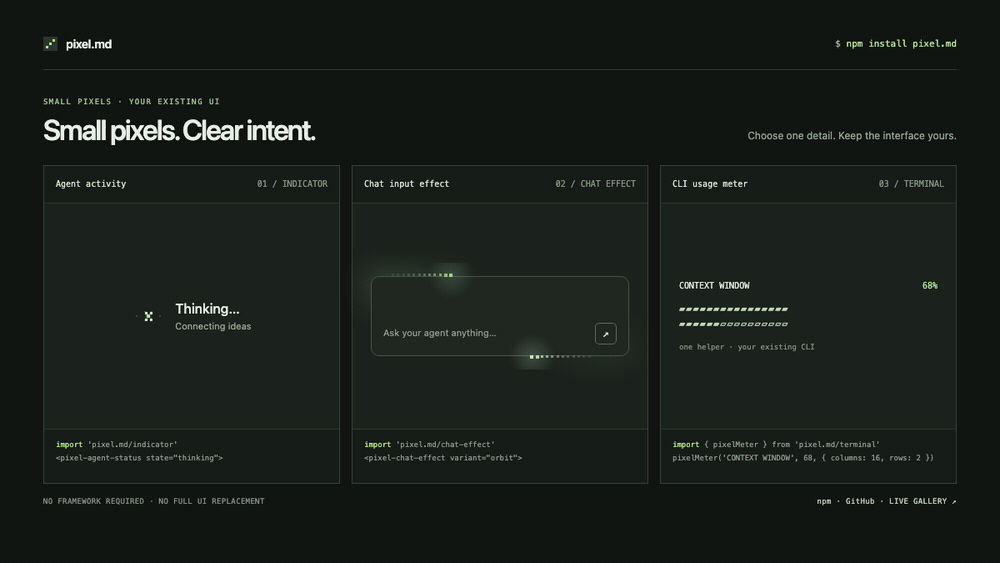

# pixel.md

<p align="center">
  <strong>Small pixel details for AI interfaces.</strong><br />
  Activity indicators, chat effects, agent UI, pixel bots, and terminal components.
</p>

<p align="center">
  <a href="https://www.npmjs.com/package/pixel.md"></a>
  <a href="https://www.npmjs.com/package/pixel.md"></a>
  <a href="LICENSE"></a>
  <a href="https://github.com/JJongyn/pixel.md/stargazers"></a>
  <a href="https://jjongyn.github.io/pixel.md/"></a>
</p>

pixel.md is a small, dependency-free component library for AI and agent products. Add one useful pixel detail to the interface you already built.

## Install

```bash
npm install pixel.md
```

[Live gallery](https://jjongyn.github.io/pixel.md/) · [npm](https://www.npmjs.com/package/pixel.md) · [GitHub](https://github.com/JJongyn/pixel.md)



The gallery lets you try every component and copy its individual usage snippet. Browser components are native Custom Elements; terminal helpers are separate Node.js functions. You add only the pieces you import.

## Quick start

Import only the browser components your app uses:

```js
import 'pixel.md/indicator';
import 'pixel.md/chat-effect';
```

```html
<pixel-agent-status
  state="thinking"
  label="Thinking…"
  detail="Connecting ideas"
></pixel-agent-status>

<pixel-chat-effect variant="orbit">
  <textarea placeholder="Ask anything…"></textarea>
</pixel-chat-effect>
```

`<pixel-chat-effect>` adds an animated pixel treatment around your input; your app keeps control of the textarea, messages, and send behavior. Change the indicator's `state`, `label`, or `detail` attributes as your agent moves through its workflow.

## Components

| Import | Element or API | Includes |
| --- | --- | --- |
| `pixel.md/indicator` | `<pixel-agent-status>` | Thinking, searching, browsing, reading, planning, acting, tool, building, verifying, and responding states |
| `pixel.md/chat-effect` | `<pixel-chat-effect>` | Orbit, Hop, Anchor, Bevel, Tilt, Prism, Car, and Cat effects, with idle and working states |
| `pixel.md/elements` | `<pixel-ui-element>` | Compact workflow controls for progress, approvals, sources, retries, streaming, handoff, and more |
| `pixel.md/bot` | `<pixel-bot-avatar>` | Eight animated pixel characters with configurable states and labels |
| `pixel.md/terminal` | Node.js functions | ANSI-friendly prompts, progress, output, task lists, confirmations, and more |
| `pixel.md/terminal-preview` | `<pixel-terminal>` | Browser preview of fourteen terminal patterns |

Import `pixel.md` to register all four browser elements at once, or use the individual subpaths above to keep imports explicit.

## Copy one component

Every preview in the [live gallery](https://jjongyn.github.io/pixel.md/) has a **Copy code** action. It copies that preview's import and usage only, so you can add a single component to your existing interface.

For example, add only a context meter to an existing Node.js CLI:

```js
import { pixelMeter } from 'pixel.md/terminal';

console.log(pixelMeter('CONTEXT WINDOW', 68, {
  max: 100,
  columns: 16,
  rows: 2,
  tone: 'mint'
}));
```

## Connect real agent state

Keep component state tied to the state machine in your app:

```js
const status = document.querySelector('pixel-agent-status');

function setAgentState(state, detail) {
  status.setAttribute('state', state);
  status.setAttribute('detail', detail);
}

setAgentState('searching', 'Looking through project files');
```

Workflow elements emit a bubbling `pixel-element-change` event so your app can handle interactions:

```js
document.querySelector('pixel-ui-element').addEventListener(
  'pixel-element-change',
  event => {
    console.log(event.detail.variant, event.detail.state);
  }
);
```

The package includes TypeScript declarations. Browser elements register when their entry point is imported; see the [live gallery](https://jjongyn.github.io/pixel.md/) for interactive examples.

## Terminal CLI

Use the Node.js entry point for terminal output and prompts. It has no runtime dependencies, respects `NO_COLOR`, and falls back to plain text when output is piped.

```js
import { askPixelCommand, pixelOutput } from 'pixel.md/terminal';

const command = await askPixelCommand({ cwd: '~/project' });

// Validate the input before passing it to your own command runner.
if (command) {
  console.log(pixelOutput({
    command,
    lines: ['Build complete'],
    status: 'success',
    duration: '1.8s'
  }));
}
```

The terminal helpers format output and collect input; they do not execute shell commands. Your CLI remains responsible for validation and execution. Node.js 18 or newer is required for the terminal entry point.

## Design principles

- **Small by default.** Pixel motion is a detail around the interface, not a replacement for it.
- **Bring your own UI.** Chat effects wrap existing inputs; they do not take over application state or interaction.
- **Native browser elements.** No React runtime or component framework is required.
- **Motion with care.** Animated browser components pause when hidden or offscreen and honor `prefers-reduced-motion`.
- **Useful in a terminal.** CLI output supports ANSI color, piped output, and `NO_COLOR`.
- **No runtime dependencies.** Browser elements and CLI helpers use platform APIs.

## Agent skills

The package includes a general [`pixel-md` catalog skill](skills/pixel-md/SKILL.md) with references for indicators, chat effects, UI elements, bots, and terminal patterns, plus focused indicator, chat-effect, and UI-element skills. To add the general skill manually to a project:

```bash
mkdir -p .agents/skills
cp -R node_modules/pixel.md/skills/pixel-md .agents/skills/
```

For Claude Code, copy the same folder to `.claude/skills/` instead. The skill is optional; the components work without it.

## Install as a coding-agent plugin

The repository also provides a plugin marketplace for Codex and Claude Code. It installs the general catalog skill and focused indicator, chat-effect, and UI-element skills. The skills guide the agent; install `pixel.md` separately in the app when you want to use the runtime components.

### Codex

```bash
codex plugin marketplace add JJongyn/pixel.md
codex plugin add pixel-md@personal
```

### Claude Code

```text
/plugin marketplace add JJongyn/pixel.md
/plugin install pixel-md@pixel-md
```

In Codex, the plugin is also listed in this repository's marketplace. In Claude Code, skills use the `/pixel-md:...` namespace. Refresh the marketplace to receive later plugin releases.

## Examples and gallery

The npm package includes the examples in `examples/`. Browse and try all components in the [live gallery](https://jjongyn.github.io/pixel.md/). To run the gallery from a repository checkout:

```bash
python3 -m http.server 4173
```

Then open `http://localhost:4173/`.

## Contributing

Bug reports, ideas, and pull requests are welcome. Please include the component or entry point involved and a short reproduction when reporting a problem.

- [Open an issue](https://github.com/JJongyn/pixel.md/issues)
- [Browse the source](https://github.com/JJongyn/pixel.md)

## License

[MIT](LICENSE) © 2026 JJongyn
