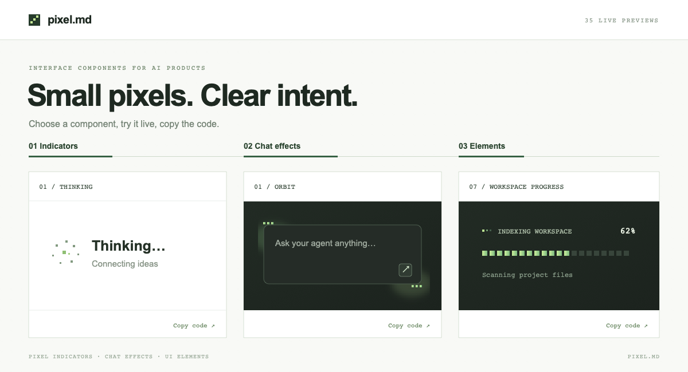

# pixel.md



Small pixel components for AI, agent, and CLI interfaces. It includes four browser-native Web Components and a dependency-free Node.js terminal UI module.

## Install

From this repository, before the npm release:

```bash
npm install ./pixel.md
```

After the package is published to npm:

```bash
npm install pixel.md
```

Import only what you use in your app's browser entry point:

```js
import 'pixel.md/indicator';
import 'pixel.md/chat-effect';
import 'pixel.md/elements';
import 'pixel.md/bot';
```

`import 'pixel.md'` registers the four browser components. Each module defines its custom element once. You can use the package in a vanilla JavaScript app or any framework that renders custom elements. Rendering does not require React.

## Indicator

```html
<pixel-agent-status
  state="thinking"
  label="Thinking…"
  detail="Connecting ideas"
></pixel-agent-status>
```

`state`: `thinking`, `searching`, `browsing`, `reading`, `planning`, `acting`, `tool`, `building`, `verifying`, `responding`. Change `state`, `label`, and `detail` attributes as the agent works. Optional attributes: `compact`, `size="large"`, `theme="dark"`, `announce`, `paused`.

Customize color with `--pixel-ink`, `--pixel-muted`, and `--pixel-accent` on the element. Motion respects `prefers-reduced-motion`.

## Chat effect

```html
<pixel-chat-effect variant="orbit" speed="1" intensity="1">
  <textarea placeholder="Ask anything…"></textarea>
</pixel-chat-effect>
```

The effect wraps your existing input; it does not replace or style it. Variants: `orbit`, `hop`, `anchor`, `bevel`, `tilt`, `prism`, `car`, `car-working`, `cat`, and `cat-working`. The car moves slowly while idle and at its regular pace with pixel exhaust while working. The cat rests its paws on the input rim while idle and eagerly eats a churro while working. Switch the `variant` attribute when your chat state changes. `speed` accepts `0.2`–`3`, and `intensity` accepts `0.2`–`1.5`. Add `paused` to stop motion. The canvas pauses when offscreen or the tab is hidden, and provides a still frame for reduced-motion users.

## UI elements

```html
<pixel-ui-element variant="progress" label="Indexing workspace" value="62"></pixel-ui-element>
```

Variants: `toggle`, `count`, `toast`, `tabs`, `check`, `reveal`, `progress`, `sources`, `retry`, `feedback`, `copy`, `file`, `queue`, `approval`, `stream`, `handoff`, `branch`, `usage`, `steps`.

Most controls work in the preview immediately. For app integration, listen for the event and update your application state:

```js
document.querySelector('pixel-ui-element').addEventListener('pixel-element-change', event => {
  console.log(event.detail.variant, event.detail.state);
});
```

The event bubbles through Shadow DOM. `label` sets the visible name on supported variants; `value` initializes `count`, `progress`, or `usage`; `text` supplies content for `copy` or `stream`. `items` accepts a JSON array of one to five strings or `{ "label": "...", "detail": "..." }` objects for `tabs`, `sources`, `queue`, `branch`, and `steps`.

## Pixel bot avatars

```html
<pixel-bot-avatar variant="mote" state="working" label="San" size="medium"></pixel-bot-avatar>
```

Variants: `mote`, `sprout`, `spark`, `wisp`, `gear`, `comet`, `prism`, and `kernel`. States: `idle`, `thinking`, `working`, `speaking`, `success`, and `sleeping`. `size` accepts `small`, `medium`, or `large`; `label` supplies the accessible name. Add `paused` to stop motion. Customize with `--pixel-bot-color` and `--pixel-bot-accent`. Animation pauses offscreen and when the page is hidden, and respects reduced-motion settings.

## Terminal UI

Use the Node.js entry point for real terminal CLI output. It uses ANSI colors when supported, falls back to plain text when piped or `NO_COLOR` is set, and has no extra dependencies.

```js
import { askPixelCommand, pixelOutput } from 'pixel.md/terminal';

const command = await askPixelCommand({ cwd: '~/project' });
// Pass the command to your own validated command runner.
console.log(pixelOutput({ command, lines: ['Build complete'], status: 'success', duration: '1.8s' }));
```

The Node module exports `pixelMark`, `pixelBox`, `pixelPrompt`, `askPixelCommand`, `pixelChoices`, `askPixelChoice`, `pixelProgress`, `pixelMeter`, `pixelTaskList`, `pixelSteps`, `pixelSpinnerFrame`, `withPixelSpinner`, `pixelWaveFrame`, `withPixelWave`, `pixelAgents`, `pixelStream`, `pixelConfirm`, `pixelDiff`, `pixelOutput`, and `pixelSession`. These render pixel-native terminal strings or read from stdin. They display and collect data; the host CLI remains responsible for validating and executing commands. `pixel-terminal` is the browser-only gallery preview, available from `pixel.md/terminal-preview` when you need an embedded web console.

Run the CLI showcase from the repository checkout with `node pixel.md/examples/terminal-preview.mjs`. Add `--interactive` to try command entry and confirmation; it still does not execute the entered command.

## Entry points

| Import | Registers |
| --- | --- |
| `pixel.md` | Four browser components |
| `pixel.md/indicator` | `<pixel-agent-status>` |
| `pixel.md/chat-effect` | `<pixel-chat-effect>` |
| `pixel.md/elements` | `<pixel-ui-element>` |
| `pixel.md/bot` | `<pixel-bot-avatar>` |
| `pixel.md/terminal` | Node.js CLI rendering and prompts |
| `pixel.md/terminal-preview` | Browser-only `<pixel-terminal>` preview |

The JavaScript modules and TypeScript declarations are included in the package. The gallery at the repository root loads these same source modules.

## For a coding agent

Copy this into your coding assistant after adding the package to your project:

> Add `pixel.md` to this app. Import only the browser entry points we use (`pixel.md/indicator`, `pixel.md/chat-effect`, `pixel.md/elements`, or `pixel.md/bot`). Use `<pixel-agent-status>` for agent activity, wrap the existing chat input with `<pixel-chat-effect>` without replacing that input, connect `<pixel-ui-element>` through `pixel-element-change`, and use `<pixel-bot-avatar>` for agent identity. For a Node.js CLI, import formatting and prompt helpers from `pixel.md/terminal`; connect returned input to the host's validated command runner. Match the existing theme and keep the components compact.

## Agent skills

This package includes the [`pixel-md` skill](skills/pixel-md/SKILL.md), with a dedicated reference for each indicator state, chat effect, UI element, bot avatar, and terminal component. The catalog links to the detailed component guides.

Install a skill into a project after installing the package:

```bash
mkdir -p .agents/skills
cp -R node_modules/pixel.md/skills/pixel-md .agents/skills/
```

For Claude Code, use `.claude/skills/` as the destination. The skill is optional; the components work without it.

## Browser-only rendering

Browser component imports are safe to evaluate during server rendering, but custom elements register only in a browser. Render the tags on the client and attach component change listeners there. `pixel.md/terminal` is a Node.js entry point and should be imported by a CLI process, not a browser bundle. In a plain HTML site without an npm bundler, import browser component files from `src/` with relative URLs instead.

## License

The distribution license has not been selected yet. The package is marked `UNLICENSED` until that decision is made; no npm release should use this placeholder.
